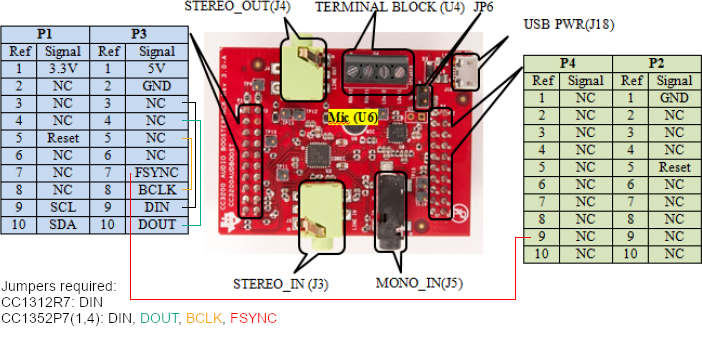

# SimpleLink&trade; CC1352P7-4 LaunchPad&trade; Settings & Resources

The [__SimpleLink&trade; CC1352P7-4 LaunchPad&trade;__][launchpad] contains a
[__CC1352P74T0RGZR__][device] device.

## Jumper Settings

* Close the __`LEDs`__ jumper to enable the on-board LEDs.
* Close the __`RXD<<`__ and __`TXD>>`__ jumpers to enable UART via the XDS110 on-board USB debugger.

## SysConfig Board File

The [LP_CC1352P7_4.syscfg.json](../.meta/LP_CC1352P7_4.syscfg.json)
is a handcrafted file used by SysConfig. It describes the physical pin-out
and components on the LaunchPad.

## Driver Examples Resources

Examples utilize SysConfig to generate software configurations into
the __ti_drivers_config.c__ and __ti_drivers_config.h__ files. The SysConfig
user interface can be utilized to determine pins and resources used.
Information on pins and resources used is also present in both generated files.

## TI BoosterPacks&trade;

The following BoosterPacks are used with some driver examples.

### [__BOOSTXL-SHARP128 LCD & SD Card BoosterPack__][boostxl-sharp128]

The SD card's default SPI Chip Select pin is not compatible with this
LaunchPad's header pin layout. Use one of the following modification(s)
to the BOOSTXL-SHARP128 to enable SD card usage with the __sdraw__,
  __fatsd__, and __fatsdraw__ examples.

* Use a jumper wire to connect BP.8 (__`SD_CS`__) and BP.12 (__`SD_CS*`__).
* Unsolder resistor __`R16`__ and re-solder it on __`R17`__.
  __`SD_CS*`__ uses the same LaunchPad header pin as __`BTN-2`__.

### [__BP-BASSENSORSMKII BoosterPack__][bp-bassensorsmkii]

The TMP116's power pin is not compatible with this LaunchPad. Use the
following modification to enable the TMP116's usage with the
__i2ctmp__ and __portable__ examples.

* Use a jumper wire to connect BoosterPack pin header BP.28 (__`T_V+`__) to BP.1 (__`3V3`__).

The OPT3001's power pin is not compatible with this LaunchPad. Use the
following modification to enable the OPT3001's usage with the
__i2copt3001_cpp__ example.

* Use a jumper wire to connect BoosterPack pin header BP.27 (__`O_V+`__) to BP.18 (unlabeled).

### [__CC3200 Audio BoosterPack__][cc3200audboost]

The BoostPack's `DIN`, `DOUT`, `BCLK` and `FSYNC`/`WCLK` signal pins are not
compatible with this LaunchPad. Use the following modifications to enable the
CC3200 Audio BoosterPack's usage with the __i2secho__ example.

On the LP_CC1352P7_4 board, bend down the following BoosterPack header pins:

* `BP.27`
* `BP.28`
* `BP.29`
* `BP.30`

Be sure that the bent pins do not make contact with the IC or any other
component, bend them enough to make sure they don't connect to the CC3200
Audio BoosterPack.

Attach the CC3200 Audio BoosterPack to the LP_CC1352P7_4 and run jumper wires
between the following pins on the CC3200 Audio BoosterPack:

* DIN: `P3.3` and `P3.9`
* DOUT: `P3.4` and `P3.10`
* BCLK: `P3.5` and `P3.8`
* FSYNC/WCLK: `P4.9` and `P3.7`

See [Audio BP User Guide][cc3200audboost-user-guide] (Figure 2-1), or the diagram
below, for information on where these pins are located.

[device]: https://www.ti.com/product/CC1352P7
[launchpad]: https://www.ti.com/tool/LP-CC1352P7
[boostxl-sharp128]: https://www.ti.com/tool/BOOSTXL-SHARP128
[bp-bassensorsmkii]: https://www.ti.com/tool/BP-BASSENSORSMKII
[cc3200audboost]: https://www.ti.com/tool/CC3200AUDBOOST
[cc3200audboost-user-guide]: https://www.ti.com/lit/pdf/swru383
